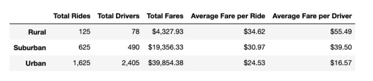
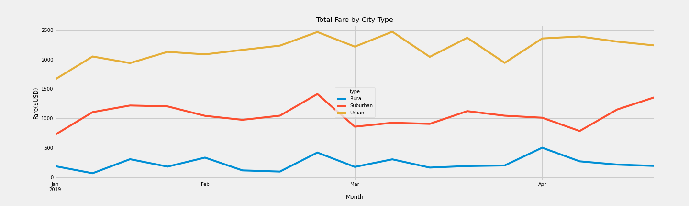

# PyBer_Analysis
Weekly Challenge 5 - Perform exploratory data analysis on ride sharing data of Pyber and create data visualizations

## Overview of the Project

### Purpose and Backgroud

The purpose of this project is to showcase the realtionship between the type of city, number of drivers and riderand percentage of total fares by city type. The analysis and
visualizations will help Pyber to improve access to ride sharing services and determine affordability for underserved neighbourhoods. We will do our analysis based on city type
to provide a summary of ride sharing data using pandas and matplotlib. Using data visualization methods we will showcase the total weekly fares for each city type that is,
Urban ,Suburban and Rural.We will use different pandas function to filter our data and aggregate it according to our requirements. We will be working with the data 
having information about each city with the total number of drivers and the ride details. 

## Results

1. As we can see from the summary dataframe below , the total number of rides taken from January to early May 2019 is maximum for the urban city type that is 1,625.
  Whereas for the rural cities its just 125 which is very less as compared to the urban cities. This implies that people in rural cities usually prefer lesser cab services
  as compared to urban and suburban cities. For suburban cities too the total rides count is moderate which is 625. Since the rural cities are an outer part of a city with low
  population density the number of rides taken is lesser.
  
2. Based on the geographical location the total number of drivers or cabs have been alloted to each city. So we can see the maximum number of drivers are in urban cities
  following the suburban cities. As demand for cabs is more in urban and suburban areas total number of drivers is also fairly high. In rural areas due to lesser demand for 
  cabs the total number of drivers is also quite low.

3. The total fares depend on the total number of rides taken in each city. So as number of rides is maximum for the urban cities, we can see the total fare for urban cities is also
   maximum(	$39,854.38). For the suburban cities the total fare is moderate($19,356.33) and lesser than urban cities whereas for the rural cities since number of rides taken is minimum, total fare is 
   also minimum($4,327.93).
   
4. The average fare per ride is more for rural areas($34.62	) as compared to urban areas($24.53) which means that the fare per city in rural areas is more than urban areas. So
   although the number of rides taken in rural areas is less but the average fare per ride is more than suburban and urban areas.
   
5. The average fare per driver is maximum for rural areas ($55.49) followed by suburban($39.50) and urban($16.57) areas. This is because the number of drivers is very less in 
   rural areas but the fare per city is quite more relatively. On the contrary the number of drivers is quite more in urban and suburban areas but fare per city is relatively low.
   So this makes the average fare per driver comparatively higher for rural cities.

6. With the below summary of the Pyber ride sharing data we can see that as the number of rides in a city increases the ,the total fare in that city also increases. But since the
   number of drivers is quite less in rural areas,base price for a ride is more in rural areas than the urban and suburban areas.
   So the average fare per driver is quite high in rural areas than in urbans and suburbs.
   
7. Below is the snapshot of the ridesharing summary dataframe and the multile line graph for weekly fare for each city type:

     

	 

## Summary

1. As we can see from the above line graph, the total fare for rural city is quite less as compared to urban cities. So we can increase the number of drivers in rural cities.
   This can increase accessibility in rural cities and also the total fare.
   
2. To increase the affordability in rural areas the average fare per ride should be reduced keeping in mind the livelihood and average income of people there.
   This way more number of people will be able to afford the Pyber rides.

3. For the urban ciites the base fare can be increased relative to the number of drivers so that average fare per driver is slightly more than what it is now.But we should also
   keep in mind the affordability of the urban city people.

   
	
  

